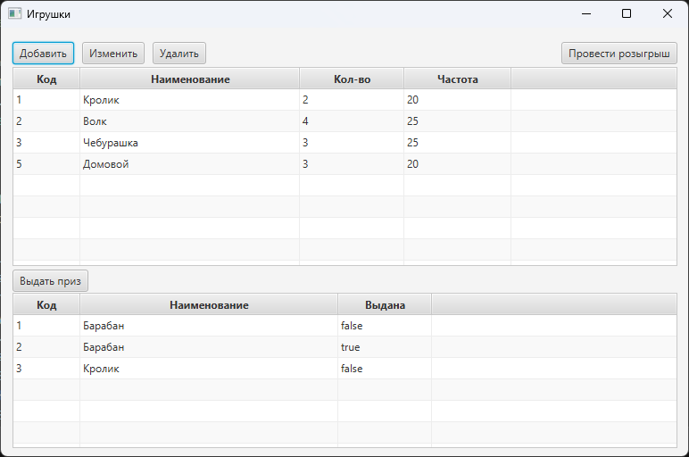
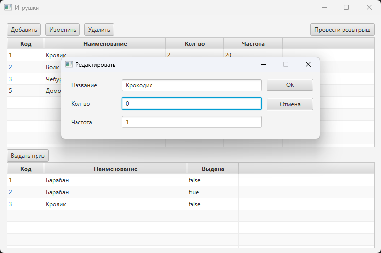
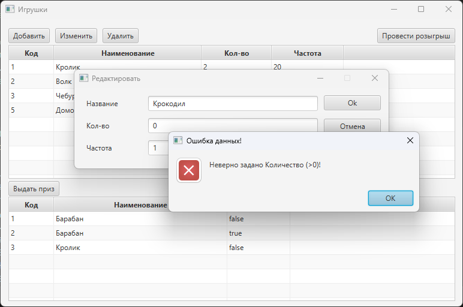
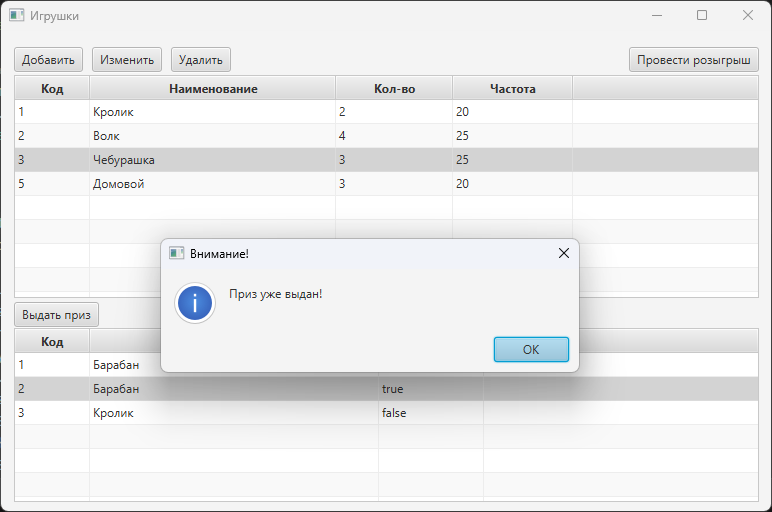
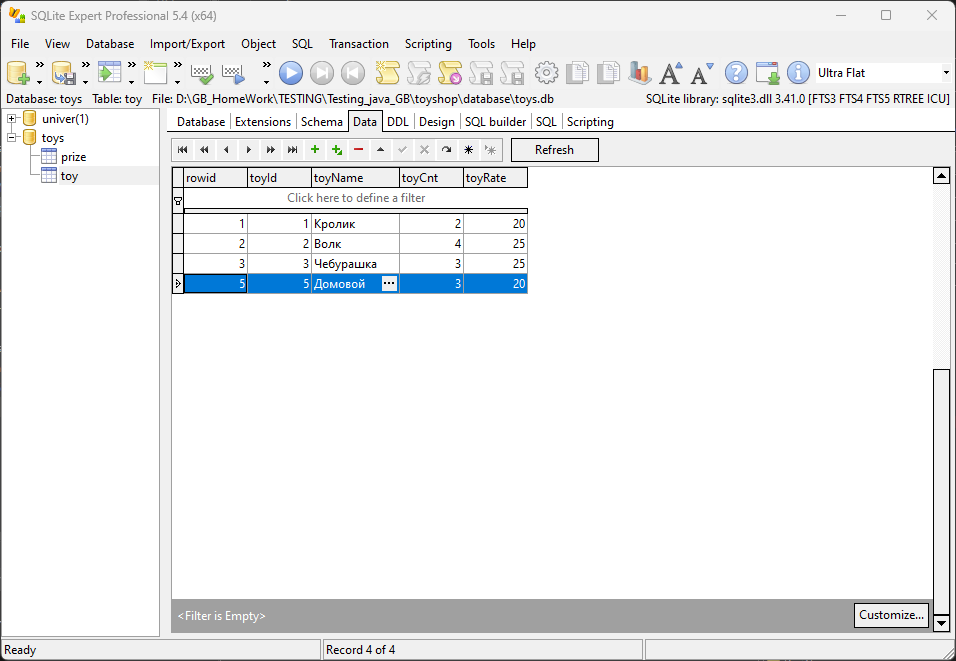

# Промежуточная аттестация (java)

## Содержание

[Промежуточная аттестация](#промежуточная-аттестация-java)<br>
[Задание](#задание)<br>
[Реализация](#реализация)<br>
[Программная реализация](#программная-реализация)<br>
[Основной функционал](#основной-функционал)<br>
[Скриншоты](#скриншоты-программы)<br>

## Задание

Необходимо написать программу – розыгрыша игрушек в магазине детских товаров.
Стараемся применять ООП и работу с файлами.
Если какой-то пункт не изучали и не знаете, как сделать, то можете сделать своим способом. Например, у кого в курсе не было ООП, то применяем списки\массивы\словари
 
Желательный функционал программы:
В программе должен быть минимум один класс со следующими свойствами:
- id игрушки
- текстовое название
- количество
- частота выпадения игрушки (вес в % от 100)
 
Метод добавление новых игрушек и возможность изменения веса (частоты выпадения игрушки)
Возможность организовать розыгрыш игрушек.

Например, следующим образом:
+ С помощью метода выбора призовой игрушки – мы получаем эту призовую игрушку и записываем в список\массив.
+ Это список призовых игрушек, которые ожидают выдачи.
+ Еще у нас должен быть метод – получения призовой игрушки.
+ После его вызова – мы удаляем из списка\массива первую игрушку и сдвигаем массив. А эту игрушку записываем в текстовый файл.
+ Не забываем уменьшить количество игрушек

К написанию программы можно подойти более творчески и делать так, как Вы поняли задание. Немного менять и отходить от примера выше.

# Реализация

## Программная реализация

* JAVA: 19.0.1
* хранение данных: SQLite
* GUI: JavaFX


## Основной функционал

+ добавление игрушки в список
+ изменение информации об игрушке
+ удаление информации об игрушке
+ проведение розыгрыша
+ выдача розыгрыша

При добавлении / изменении информации об игрушке производится проверка валидности данных. Для проверки числовых данных используются регулярные выражения.

Розыгрыш реализуется с использованием ```PriorityQueue```. При розыгрыше количество выпавшей игрушки в магазине уменьшается на 1. Если при этом количество становится равным 0 - информация об игрушке удаляется из списка магазина.

Разыгранная игрушка при этом добавляется в список призов, и в последствии может быть выдана победителю.

## Скриншоты программы












